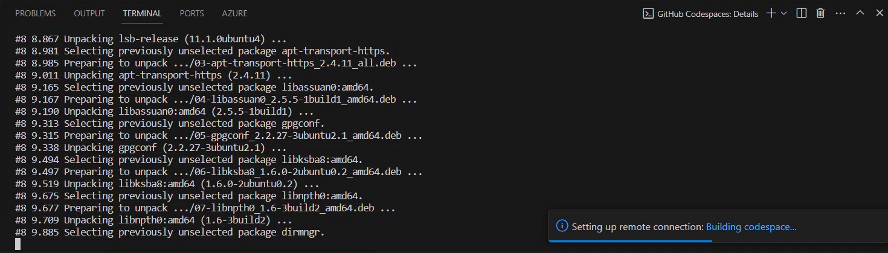

# Create a dev container in your GitHub Codespace including the Azure CLI and Terraform

Almost from scratch, I would like to describe the necessary steps for creating a dev container, which includes the Azure CLI and Terraform.

## Create a Codespace using the provided configuration files

To create a new Codespace, I’ll click on the “Remote Explorer” icon in Visual Studio Code, then I’ll switch to “GitHub Codespace”. Next I have to click on the “+” button:

  

Now I’ll select the repository that I want to use for the Codespace:

  

As the last step, I’ll choose which instance I would like to use. I’ll choose the 2 cores option:

  

After that, the Codespace will be created:

  

After the successful creation, I can recognize that an active Codespace is available for my repository:

  

That is the view in Visual Studio Code:

  

